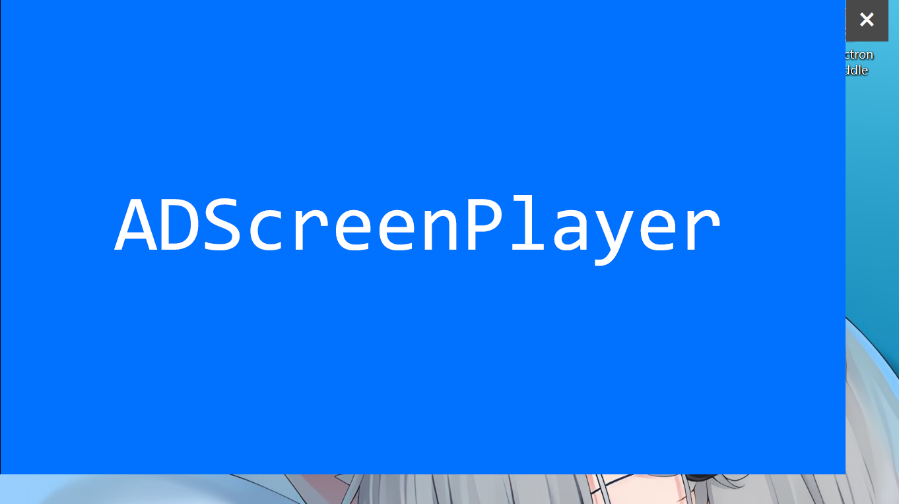

# ADScreenPlayer

基于electron的广告屏播放器。

运行后，左上角会出现一个指定大小的置顶窗口。



***
## 配置

视频在 `conf/video/` 目录。

配置文件 `conf/config.json`  
`width` 窗口宽度  
`height` 窗口高度  
`x` 窗口左上角横向位置  
`y` 窗口左上角竖向位置  
`debugmode` 调试模式，开启后会显示一些调试工具，使用时请关闭  
`muted` 静音  
`fullscreen` 全屏  
`minimizable` 允许最小化  
`maximizable` 允许最大化  
`alwaysOnTop` 始终置顶  

***
## 下载仓库

首先安装 nodejs、npm、git 最新版本，然后
```
git clone https://github.com/bddjr/ADScreenPlayer
cd ADScreenPlayer
npm config set registry https://registry.npmmirror.com
npm install
```

***
## 直接运行
```
npm run start
```

***
## 编译
编译后的文件在 `dist` 目录。  
您可以选择构建后将 `win-unpacked` 或 `linux-unpacked` 压缩。  

构建适用于该系统的可执行文件  
```
npm run pack
```

构建Windows的可执行文件
```
npm run pw
```

构建Windows的可执行文件与7z压缩包
```
npm run pw7
```

构建Linux的可执行文件
```
npm run pl
```

构建Linux的可执行文件与7z压缩包
```
npm run pl7
```

构建Windows与Linux的可执行文件
```
npm run pwl
```

构建Windows与Linux的可执行文件与7z压缩包
```
npm run pwl7
```

构建适用于该系统的可执行文件与安装包
```
npm run dist
```
